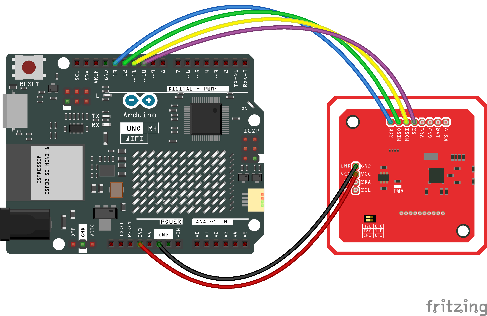
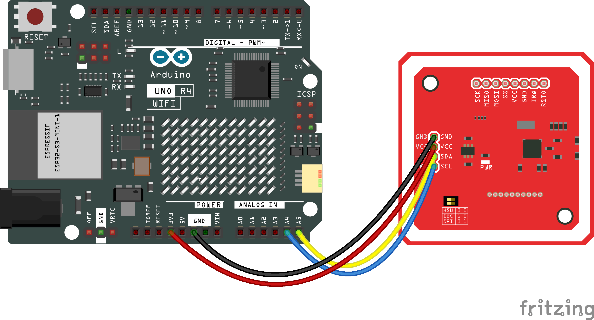

<div align="center">


### cryptnox-sdk-arduino

Arduino library for managing Cryptnox Hardware Wallet

📄 [Download this documentation as PDF](https://docs.cryptnox.com/cryptnox-sdk-arduino/cryptnox-sdk-arduino.pdf)

</div>

<br/>
<br/>

[](https://github.com/cryptnox/cryptnox-sdk-arduino/actions/workflows/misra_check.yml)
[](https://store.arduino.cc/products/uno-r4-minima)
[](https://www.arduino.cc/en/software)
[](https://www.gnu.org/licenses/lgpl-3.0)

`cryptnox-sdk-arduino` is an Arduino library that enables the use of the **Cryptnox Hardware Wallet** on Arduino UNO R4 platforms.
It provides secure communication with the card, retrieves card information, and exposes basic cryptographic operations through the shared C++ core SDK.

---

## Supported hardware

### Cryptnox Hardware Wallet

Works with Cryptnox Hardware Wallet running firmware v1.6.0 or later.

| Hardware Wallet | Wallet version |
|------|---------------|
| [Crypto Hardware Wallet – Dual Card Set](https://shop.cryptnox.com/product/hardware-wallet-smartcard-dual/) | v1.6.1 |

### NFC readers

| Reader | Type | Interface |
|--------|------|-----------|
| [PN532 NFC Module](https://www.nxp.com/products/PN532) | Contactless (NFC/ISO 14443) | SPI or I²C |

### Host board

| Board | MCU | Notes |
|-------|-----|-------|
| [Arduino UNO R4 Minima](https://store.arduino.cc/products/uno-r4-minima) | Renesas RA4M1 (Cortex-M4) | Recommended for compact projects |
| [Arduino UNO R4 WiFi](https://store.arduino.cc/products/uno-r4-wifi) | Renesas RA4M1 + ESP32-S3 | Adds Wi-Fi/Bluetooth via the on-board ESP32-S3 |

---

## Installation

> [!IMPORTANT]
> The library cannot be installed from the Arduino Library Manager alone:
> it depends on patched versions of `AESLib`, `Adafruit_PN532`, and on
> Renesas-core memory optimisations without which sketches will either
> fail to compile or overflow flash on the UNO R4. The `setup.bat`
> installer below applies all of these automatically.

### Prerequisites

1. Install **[Arduino IDE 2.x](https://www.arduino.cc/en/software)**.
2. Add the **Arduino UNO R4** board support package:
   *Tools* → *Board* → *Boards Manager* → search for `Arduino UNO R4 Boards` → **Install**.
3. Install **[git](https://git-scm.com/)** and make sure it is in `PATH`.

### Install (Windows — `setup.bat`)

```bat
git clone --recurse-submodules https://github.com/cryptnox/cryptnox-sdk-arduino.git
cd cryptnox-sdk-arduino
setup.bat
```

`setup.bat` performs every step the library needs to compile and run:

1. backs up the current `Arduino\libraries` folder (sibling directory,
   timestamped),
2. copies the SDK into `libraries\CryptnoxWallet`,
3. clones each pinned third-party dependency (`AESLib`,
   `Adafruit_BusIO`, `Adafruit_PN532`, `ArduinoHttpClient`, `Crypto`,
   `micro-ecc`, `trng`),
4. applies the patches from `patches\` — **required**, not optional:
   - `AESLib_renesas.patch` (compile on the Renesas core),
   - `AESLib_no_iostream.patch` (≈ 145 KB flash saved),
   - `Adafruit_PN532_timeout.patch` (longer card-detection window),
   - `Adafruit_PN532_extended_frame.patch` (extended-frame APDU support
     so certificate pages > 255 bytes deliver intact),
5. runs `scripts\enable_memory_optimization.bat` to strip the AVR-compat
   float-printf hard pull and add `-fno-exceptions -fno-rtti` + uECC
   curve trimming to the core (≈ 11 KB more flash saved).

Pass `--reset` to wipe `Arduino\libraries` after the backup. Pass a path
as the first argument to target a non-default libraries directory.

When the script finishes, **restart the Arduino IDE**, then open
*File* → *Examples* → **CryptnoxWallet** → **Connect**, select your board
(*Tools* → *Board* → **Arduino UNO R4 Minima** or **WiFi**), pick the
serial port, and **Upload**.

> [!TIP]
> macOS / Linux: no installer is shipped yet. Follow
> [DEVELOPMENT.md](DEVELOPMENT.md) to clone the repo into your
> `Arduino/libraries` directory and apply the patches under `patches\`
> by hand — they are unified diffs and `patch -p1` works on all four.
>
> See [DEVELOPMENT.md](DEVELOPMENT.md) for the source-build workflow,
> coding style, and release process.

## Hardware setup

> [!CAUTION]
> Always double-check the wiring before powering the Arduino to prevent damage.

Wiring shown for the **Arduino UNO R4 WiFi** (identical pin numbering on the Minima variant).

### Arduino UNO R4 and PN532 NFC — SPI interface

| PN532 Pin | Arduino Pin | Wire Color |
|-----------|-------------|------------|
| VCC       | 3.3V        | Red        |
| GND       | GND         | Black      |
| SCK       | D13         | Blue       |
| MISO      | D12         | Green      |
| MOSI      | D11         | Yellow     |
| SS        | D10         | Violet     |

> [!IMPORTANT]
> Make sure the switches on the PN532 module are configured for **SPI** mode:
>
> - **Switch 0** → HIGH
> - **Switch 1** → LOW



### Arduino UNO R4 and PN532 NFC — I²C interface

| PN532 Pin | Arduino Pin | Wire Color |
|-----------|-------------|------------|
| VCC       | 3.3V        | Red        |
| GND       | GND         | Black      |
| SDA       | A4          | Yellow     |
| SCL       | A5          | Blue       |

> [!IMPORTANT]
> Make sure the switches on the PN532 module are configured for **I²C** mode:
>
> - **Switch 0** → LOW
> - **Switch 1** → HIGH



---

## Quick usage examples

Full sketches live under [`examples/`](examples/). Each one is also visible
from the Arduino IDE under *File → Examples → CryptnoxWallet*. The
snippets below show the interesting part — see the linked `.ino` for the
complete file (setup, error handling, comments).

### 1. Connect & read card info — [`Connect.ino`](examples/Connect/Connect.ino)

```cpp
#include <CryptnoxWallet.h>
#include <SPI.h>

ArduinoLoggerAdapter   serialAdapter;
PN532Adapter           nfc(serialAdapter, /*SS=*/10U, &SPI);
ArduinoCryptoProvider  cryptoProvider;
ArduinoPlatform        platform;
CryptnoxWallet         wallet(nfc, serialAdapter, cryptoProvider, platform);

void setup() {
    serialAdapter.begin(115200);
    SPI.begin();
    if (!wallet.begin()) {
        serialAdapter.println(F("PN532 init failed"));
        while (1);
    }
}

void loop() {
    CW_SecureSession session;
    if (wallet.connect(session)) {
        serialAdapter.println(F("Card connected, secure channel established"));
        CW_CardInfo info;
        if (wallet.getCardInfo(session, &info)) {
            serialAdapter.print(F("Owner name : "));
            serialAdapter.println(info.name);
            serialAdapter.print(F("Owner email: "));
            serialAdapter.println(info.email);
        } else {
            serialAdapter.println(F("getCardInfo failed (channel error or parse error)"));
        }
    } else {
        serialAdapter.println(F("Card not detected or secure channel failed"));
    }
    wallet.disconnect(session);
    delay(1000);
}
```

### 2. Verify the PIN — [`VerifyPin.ino`](examples/VerifyPin/VerifyPin.ino)

```cpp
const char* pin = "000000000";  // must match the PIN set on the card

if (!wallet.verifyPin(session,
                      reinterpret_cast<const uint8_t*>(pin),
                      (uint8_t)strlen(pin))) {
    serialAdapter.println(F("Wrong PIN — halting to protect retry counter"));
    wallet.disconnect(session);
    while (1);   // each wrong attempt burns one retry; do NOT loop
}
serialAdapter.println(F("PIN accepted"));
```

### 3. Sign a 32-byte hash — [`Sign.ino`](examples/Sign/Sign.ino)

```cpp
uint8_t hash[CW_HASH_SIZE];
memset(hash, 0x01, sizeof(hash));   // replace with SHA-256 of your tx

CW_SignRequest req(session,
                   CW_SIGN_CURR_K1,
                   CW_SIGN_SIG_ECDSA_LOW_S,
                   CW_SIGN_WITH_PIN);
req.hash       = hash;
req.hashLength = sizeof(hash);
CW_Utils::safe_memcpy(req.pin, sizeof(req.pin),
                      reinterpret_cast<const uint8_t*>("000000000"), 9U);

CW_SignResult sig = wallet.sign(req);
if (sig.errorCode == CW_OK) {
    // sig.signature = r[32] || s[32]   (raw, ready to forward / DER-encode)
}
CW_Utils::secure_wipe(hash, sizeof(hash));
CW_Utils::secure_wipe(sig.signature, sizeof(sig.signature));
```

For a full end-to-end real-world flow (WiFi + JSON-RPC + EIP-1559 tx), see
[`examples/UsdcSigning/`](examples/UsdcSigning/) which signs and broadcasts
a USDC transfer on Sepolia.

> [!NOTE]
> The card must have a seed loaded before signing will work. The easiest way to provision it is with the [Cryptnox CLI](https://github.com/cryptnox/cryptnox-cli):
> ```
> cryptnox init
> cryptnox seed generate
> ```
> Advanced users can script the same flow via [cryptnox-sdk-py](https://github.com/cryptnox/cryptnox-sdk-py) (`card.generate_seed(pin)` or `card.load_seed(seed, pin)`). The default PIN shown above (`000000000`) must match the one set during initialization.

> [!WARNING]
> The PIN `"000000000"` is a demo placeholder. Set a strong PIN when initialising the card, change any factory default before storing real funds, and never commit source files containing a real PIN.

---

## Troubleshooting

- **The library doesn't appear in the Arduino IDE** → restart the IDE after installation.
- **The PN532 is not detected** → check the wiring and the switch configuration (SPI vs I²C). They must match the interface defined in your sketch (`USE_SPI` or `USE_I2C`).
- **Upload fails** → verify that the correct board (Arduino UNO R4 Minima / WiFi) and the correct port are selected in the *Tools* menu.
- **`Sign failed` with a non-zero error code** → the card may not have a seed loaded. Provision it once with the [Cryptnox CLI](https://github.com/cryptnox/cryptnox-cli).

---

## Documentation

The generated documentation for this project is available [here](https://cryptnox.github.io/cryptnox-sdk-arduino/).

---

## Contributing

Contributions are welcome! See [CONTRIBUTING.md](CONTRIBUTING.md) for how to propose changes, and [DEVELOPMENT.md](DEVELOPMENT.md) for the development setup.

---

## License

`cryptnox-sdk-arduino` is dual-licensed:

- **LGPL-3.0** for open-source projects and proprietary projects that comply with LGPL requirements
- **Commercial license** for projects that require a proprietary license without LGPL obligations (see [COMMERCIAL.md](COMMERCIAL.md) for details)

For commercial inquiries, contact: contact@cryptnox.com
